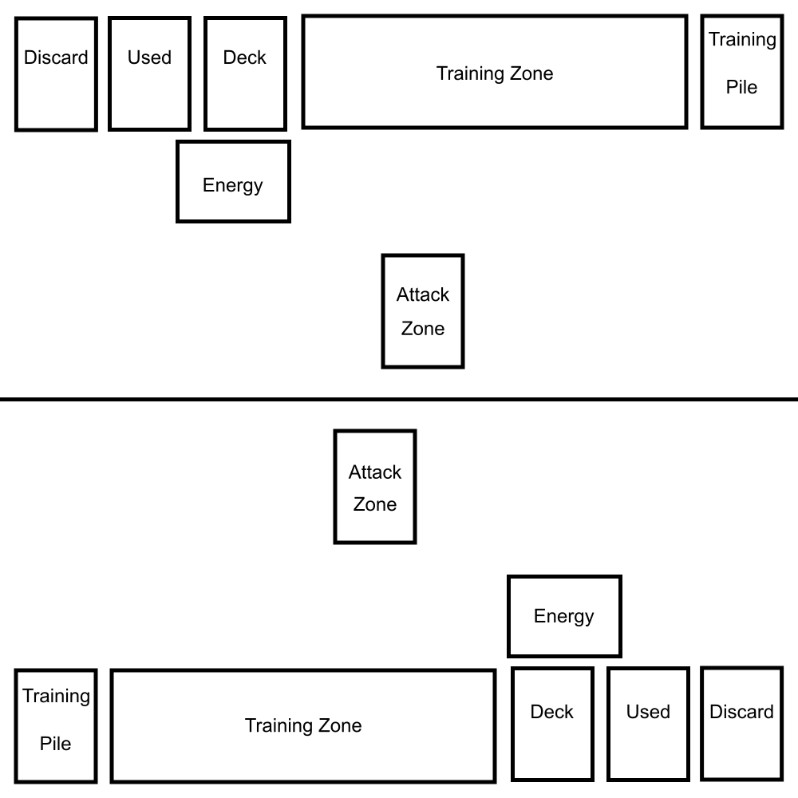

# How To Play

The game is a one on one combat where you use your training and wits to reduce your opponent to zero life cards.
This initial version is a mystery meat meant to validate core concepts.

## Game Setup

To begin, each player will need a test deck.
You will also need a die or dice and a first player token.

Each player separates the attack cards from the lesson cards.

Shuffle your training cards and set them in your Training Pile, to the right of your play space.

Shuffle your attack cards and set them in the Deck zone.

Randomly decide first player and give them the first player token.
4s4which will have no cards):

* Between your Training Pile and Deck is the Training Zone.
* Above your deck, turned 90 degrees, is your Energy Zone.
* To the right of your deck is the Used pile.
* To the right of your Used pile is your Discard pile.

Cards are also removed from play. This isn't a zone in the same sense.

Draw 4 cards, keep two in your hand and put the other two cards face down in your used pile.

You are ready to begin.

## Mechanics

This is a reference section for specific names mechanics used later.

### Charge X

When you are instructed to Charge:
take a card one at a time from the top of your deck and add it to the top of your energy pile face down.
Do this once for each level of charge you gain.

Example:

If your energy pile is empty, when you charge for three, you would put the top card of your deck into the energy zone.
Then the next card goes on top of it.
Finally, the third card on your deck goes on top.

You may charge up less than your full charge value.

### Look at

Cards you look at on top of your deck are not drawn.
During the prep phase you look at cards on your deck and may keep (draw) some.
Unless instructed otherwise, the cards you look at can be put back on the top of the deck in any order.

### Keep x

When you're instructed to keep a card, you draw it into your hand.

### Pay X

To pay energy, you move energy cards one at a time from your energy zone to your used pile.

## Cards

Description of the values on a card.

## Rounds

A round is made up of multiple phases:

* Charge Up Phase
* Prep Phase
* Combat Phase
* Training Phase
* Refresh Phase

### Charge Up

In the charge up phase, each player charges 1 plus 1 for each charge stat on lessons in the training zone.

For the first turn this will be 1 energy.

### Prep Phase

Starting with the first player, each player looks at cards equal to 2 + 1 for each see stat on lessons in their training zone.
They may then keep 1 card + 1 for each keep on lessons in the training zone.

### Combat Phase

First, the first player gets to decide if you enter combat.
If they choose to not engage, this step ends.

If they choose to start, they become the active player.

A combat turn consists of:

1. Decide to play or pass.
2. Play an attack from your hand.
3. Pay step
4. Resolve damage step
5. End Step

Continue combat turns until there have been two pass events.

Example: If a player passes, the opponent plays an attack, and then passes again, this will end the combat phase.
If both players pass in succession, it also ends the combat phase.

#### Play or Pass

Each turn starts with the decision to play an attack or pass.

If you pass, skip to step 5.

#### Play An Attack

Choose a card from your hand that you can pay the energy cost of.

Put it into the attack zone.

#### Pay costs

You may choose whether or not to pay for the attack.

If you do, pay energy equal to its cost in the top left corner.

If you do not, skip to the End Step.

#### Resolve Damage

All attacks deal at least one damage.

When you receive damage, choose your deck, energy pile, or used pile and discard the top card.
You may pay energy equal to its cost to prevent damage equal to that card's defense value.
If there is remaining damage, repeat this process.

#### End Step

If there is an attack in the active player's attack zone, it is placed face down in the used pile.
If the active player passed, and this is the second pass of the combat phase, end combat.
Otherwise, the active player passes to the opponent, who takes their own combat turn.

### Training Phase

Each player may pay 1 energy per Lesson in their Training Zone.
If they do, they may flip the top card of their training pile into their Training Zone.

### Refresh Phase

Both players may draw cards into their hand from their energy zone.
Then put the used pile on the bottom of the deck, clearing the used pile.
Pass the first player token to the other player, and start a new round.